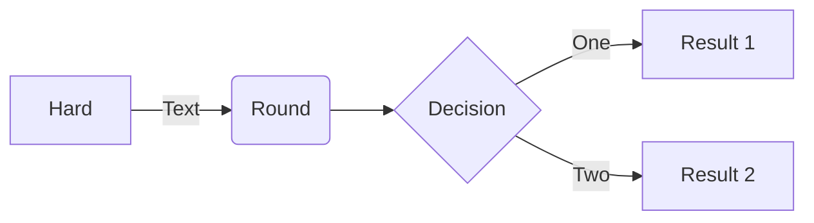

### Nueva Nota [+](https://studies.cs.helsinki.fi/exampleapp/notes): 

> Formularios y HTTP POST, flujo para agregar una nueva nota:

sequenceDiagram
Usuario->>Navegador: Abre Navegacion
Navegador->>Servidor: GET URL 
Usuario->>Navegador: Nueva Nota
loop Escribir Nota
    Usuario->>Usuario: Nueva Nota Escrita
end
Usuario->>Navegador: Guardar
Navegador->>Servidor: POST Nueva Nota
Navegador->>Servidor: GET URL
Usuario-->>Navegador: Cierra Navegacion


sequenceDiagram
Alice->>John: Hello John, how are you?
loop Healthcheck
    John->>John: Fight against hypochondria
end
Note right of John: Rational thoughts!
John-->>Alice: Great!
John->>Bob: How about you?
Bob-->>John: Jolly good!

https://www.mermaidchart.com/raw/893ef463-8d5d-4a1f-a23a-b97108780e02?theme=light&version=v0.1&format=svg


classDiagram
    Animal <|-- Duck
    Animal <|-- Fish
    Animal <|-- Zebra
    Animal : +int age
    Animal : +String gender
    Animal: +isMammal()
    Animal: +mate()
    class Duck{
      +String beakColor
      +swim()
      +quack()
    }
    class Fish{
      -int sizeInFeet
      -canEat()
    }
    class Zebra{
      +bool is_wild
      +run()
    }


## Examples

**The following are some examples of the diagrams, charts and graphs that can be made using Mermaid. Click here to jump into the [text syntax](https://mermaid-js.github.io/mermaid/#/n00b-syntaxReference).**

<!-- <Flowchart> -->

### Flowchart [<a href="https://mermaid-js.github.io/mermaid/#/flowchart">docs</a> - <a href="https://mermaid.live/edit#pako:eNpNkMtqwzAQRX9FzKqFJK7t1km8KDQP6KJQSLOLvZhIY1tgS0GWmgbb_165IaFaiXvOFTPqgGtBkEJR6zOv0Fj2scsU8-ft8I5G5Gw6fe339GN7tnrYaafE45WvRsLW3Ya4bKVWwzVe_xU-FfVsc9hR62rLwvw_2591z7Y3FuUwgYZMg1L4ObrRzMBW1FAGqb8KKtCLGWRq8Ko7CbS0FdJqA2mBdUsTQGf110VxSK1xdJM2EkuDzd2qNQrypQ7s5TQuXcrW-ie5VoUsx9yZ2seVtac2DYIRz0ppK3eccd0ErRTjD1XfyyRIomSBUUzJPMaXOBb8GC4XRfQcFmL-FEYIwzD8AggvcHE">live editor</a>]

```
flowchart LR

A[Hard] -->|Text| B(Round)
B --> C{Decision}
C -->|One| D[Result 1]
C -->|Two| E[Result 2]
```



### Sequence diagram [<a href="https://mermaid-js.github.io/mermaid/#/sequenceDiagram">docs</a> - <a href="https://mermaid.live/edit#pako:eNo9kMluwjAQhl_F-AykQMuSA1WrbuLQQ3v1ZbAnsVXHkzrjVhHi3etQwKfRv4w-z0FqMihL2eF3wqDxyUEdoVHhwTuNk-12RzaU4g29JzHMY2HpV0BE0VO6V8ETtdkGz1Zb1F8qiPyG5LX84mrLAmpwoWNh-5a0pWCiAxUwGBXeiVHEU4oq8V_6AHYUwAu2lLLTjVQ4bc1rT2yleI0IfJG320faZ9ABbk-Jz3hZnFxBduR9L2oiM5Jj2WBswJn8-cMArSRbbFDJMo8GK0ielVThmKOpNcD4bBxTlGUFvsOxhMT02QctS44JL6HzAS-iJzCYOwfJfTscunYd542aQuXqQU_RZ9kyt11ZFIM9rR3btJ9qaorOGQuR7c9mWSznyzXMF7hcLeBusTB6P9usq_ntrDKrm9kc5PF4_AMJE56Z">live editor</a>]

```

<svg aria-roledescription="classDiagram" role="graphics-document document" viewBox="0 0 482.0546875 388" style="max-width: 100%;" xmlns="http://www.w3.org/2000/svg" width="100%" id="graph-div" height="100%" xmlns:xlink="http://www.w3.org/1999/xlink"><style>@import url("https://cdnjs.cloudflare.com/ajax/libs/font-awesome/6.2.0/css/all.min.css");'</style><style>#graph-div{font-family:"trebuchet ms",verdana,arial,sans-serif;font-size:16px;fill:#ccc;}#graph-div .error-icon{fill:#a44141;}#graph-div .error-text{fill:#ddd;stroke:#ddd;}#graph-div .edge-thickness-normal{stroke-width:2px;}#graph-div .edge-thickness-thick{stroke-width:3.5px;}#graph-div .edge-pattern-solid{stroke-dasharray:0;}#graph-div .edge-pattern-dashed{stroke-dasharray:3;}#graph-div .edge-pattern-dotted{stroke-dasharray:2;}#graph-div .marker{fill:lightgrey;stroke:lightgrey;}#graph-div .marker.cross{stroke:lightgrey;}#graph-div svg{font-family:"trebuchet ms",verdana,arial,sans-serif;font-size:16px;}#graph-div g.classGroup text{fill:#81B1DB;stroke:none;font-family:"trebuchet ms",verdana,arial,sans-serif;font-size:10px;}#graph-div g.classGroup text .title{font-weight:bolder;}#graph-div .nodeLabel,#graph-div .edgeLabel{color:#e0dfdf;}#graph-div .edgeLabel .label rect{fill:#1f2020;}#graph-div .label text{fill:#e0dfdf;}#graph-div .edgeLabel .label span{background:#1f2020;}#graph-div .classTitle{font-weight:bolder;}#graph-div .node rect,#graph-div .node circle,#graph-div .node ellipse,#graph-div .node polygon,#graph-div .node path{fill:#1f2020;stroke:#81B1DB;stroke-width:1px;}#graph-div .divider{stroke:#81B1DB;stroke-width:1;}#graph-div g.clickable{cursor:pointer;}#graph-div g.classGroup rect{fill:#1f2020;stroke:#81B1DB;}#graph-div g.classGroup line{stroke:#81B1DB;stroke-width:1;}#graph-div .classLabel .box{stroke:none;stroke-width:0;fill:#1f2020;opacity:0.5;}#graph-div .classLabel .label{fill:#81B1DB;font-size:10px;}#graph-div .relation{stroke:lightgrey;stroke-width:1;fill:none;}#graph-div .dashed-line{stroke-dasharray:3;}#graph-div .dotted-line{stroke-dasharray:1 2;}#graph-div #compositionStart,#graph-div .composition{fill:lightgrey!important;stroke:lightgrey!important;stroke-width:1;}#graph-div #compositionEnd,#graph-div .composition{fill:lightgrey!important;stroke:lightgrey!important;stroke-width:1;}#graph-div #dependencyStart,#graph-div .dependency{fill:lightgrey!important;stroke:lightgrey!important;stroke-width:1;}#graph-div #dependencyStart,#graph-div .dependency{fill:lightgrey!important;stroke:lightgrey!important;stroke-width:1;}#graph-div #extensionStart,#graph-div .extension{fill:transparent!important;stroke:lightgrey!important;stroke-width:1;}#graph-div #extensionEnd,#graph-div .extension{fill:transparent!important;stroke:lightgrey!important;stroke-width:1;}#graph-div #aggregationStart,#graph-div .aggregation{fill:transparent!important;stroke:lightgrey!important;stroke-width:1;}#graph-div #aggregationEnd,#graph-div .aggregation{fill:transparent!important;stroke:lightgrey!important;stroke-width:1;}#graph-div #lollipopStart,#graph-div .lollipop{fill:#1f2020!important;stroke:lightgrey!important;stroke-width:1;}#graph-div #lollipopEnd,#graph-div .lollipop{fill:#1f2020!important;stroke:lightgrey!important;stroke-width:1;}#graph-div .edgeTerminals{font-size:11px;}#graph-div .classTitleText{text-anchor:middle;font-size:18px;fill:#ccc;}#graph-div :root{--mermaid-font-family:"trebuchet ms",verdana,arial,sans-serif;}</style><g><defs><marker orient="auto" markerHeight="240" markerWidth="190" refY="7" refX="18" class="marker aggregation classDiagram" id="graph-div_classDiagram-aggregationStart"><path d="M 18,7 L9,13 L1,7 L9,1 Z"></path></marker></defs><defs><marker orient="auto" markerHeight="28" markerWidth="20" refY="7" refX="1" class="marker aggregation classDiagram" id="graph-div_classDiagram-aggregationEnd"><path d="M 18,7 L9,13 L1,7 L9,1 Z"></path></marker></defs><defs><marker orient="auto" markerHeight="240" markerWidth="190" refY="7" refX="18" class="marker extension classDiagram" id="graph-div_classDiagram-extensionStart"><path d="M 1,7 L18,13 V 1 Z"></path></marker></defs><defs><marker orient="auto" markerHeight="28" markerWidth="20" refY="7" refX="1" class="marker extension classDiagram" id="graph-div_classDiagram-extensionEnd"><path d="M 1,1 V 13 L18,7 Z"></path></marker></defs><defs><marker orient="auto" markerHeight="240" markerWidth="190" refY="7" refX="18" class="marker composition classDiagram" id="graph-div_classDiagram-compositionStart"><path d="M 18,7 L9,13 L1,7 L9,1 Z"></path></marker></defs><defs><marker orient="auto" markerHeight="28" markerWidth="20" refY="7" refX="1" class="marker composition classDiagram" id="graph-div_classDiagram-compositionEnd"><path d="M 18,7 L9,13 L1,7 L9,1 Z"></path></marker></defs><defs><marker orient="auto" markerHeight="240" markerWidth="190" refY="7" refX="6" class="marker dependency classDiagram" id="graph-div_classDiagram-dependencyStart"><path d="M 5,7 L9,13 L1,7 L9,1 Z"></path></marker></defs><defs><marker orient="auto" markerHeight="28" markerWidth="20" refY="7" refX="13" class="marker dependency classDiagram" id="graph-div_classDiagram-dependencyEnd"><path d="M 18,7 L9,13 L14,7 L9,1 Z"></path></marker></defs><defs><marker orient="auto" markerHeight="240" markerWidth="190" refY="7" refX="13" class="marker lollipop classDiagram" id="graph-div_classDiagram-lollipopStart"><circle r="6" cy="7" cx="7" fill="transparent" stroke="black"></circle></marker></defs><defs><marker orient="auto" markerHeight="240" markerWidth="190" refY="7" refX="1" class="marker lollipop classDiagram" id="graph-div_classDiagram-lollipopEnd"><circle r="6" cy="7" cx="7" fill="transparent" stroke="black"></circle></marker></defs><g class="root"><g class="clusters"></g><g class="edgePaths"><path marker-start="url(#graph-div_classDiagram-extensionStart)" style="fill:none" class="edge-pattern-solid relation" id="id1" d="M183.8026638880358,142.79083130276305L166.46185532336315,153.65902608563587C149.12104675869054,164.5272208685087,114.43942962934527,186.26361043425436,97.09862106467263,201.29847188379384C79.7578125,216.33333333333334,79.7578125,224.66666666666666,79.7578125,228.83333333333334L79.7578125,233"></path><path marker-start="url(#graph-div_classDiagram-extensionStart)" style="fill:none" class="edge-pattern-solid relation" id="id2" d="M259.2578125,201L259.2578125,202.16666666666666C259.2578125,203.33333333333334,259.2578125,205.66666666666666,259.2578125,213.33333333333334C259.2578125,221,259.2578125,234,259.2578125,240.5L259.2578125,247"></path><path marker-start="url(#graph-div_classDiagram-extensionStart)" style="fill:none" class="edge-pattern-solid relation" id="id3" d="M334.22380800448576,147.7955230841514L348.6077306287381,157.82960257012618C362.99165325299055,167.86368205610094,391.7594985014953,187.93184102805048,406.14342112574764,204.46592051402524C420.52734375,221,420.52734375,234,420.52734375,240.5L420.52734375,247"></path></g><g class="edgeLabels"><g class="edgeLabel"><g transform="translate(0, 0)" class="label"><foreignObject height="0" width="0"><div style="display: inline-block; white-space: nowrap;" xmlns="http://www.w3.org/1999/xhtml"><span class="edgeLabel"></span></div></foreignObject></g></g><g class="edgeLabel"><g transform="translate(0, 0)" class="label"><foreignObject height="0" width="0"><div style="display: inline-block; white-space: nowrap;" xmlns="http://www.w3.org/1999/xhtml"><span class="edgeLabel"></span></div></foreignObject></g></g><g class="edgeLabel"><g transform="translate(0, 0)" class="label"><foreignObject height="0" width="0"><div style="display: inline-block; white-space: nowrap;" xmlns="http://www.w3.org/1999/xhtml"><span class="edgeLabel"></span></div></foreignObject></g></g></g><g class="nodes"><g transform="translate(259.2578125, 95.5)" id="classId-Animal-20" class="node default"><rect height="175" width="120.40625" y="-87.5" x="-60.203125" class="outer title-state"></rect><line y2="-51.5" y1="-51.5" x2="60.203125" x1="-60.203125" class="divider"></line><line y2="20.5" y1="20.5" x2="60.203125" x1="-60.203125" class="divider"></line><g class="label"><foreignObject height="0" width="0"><div style="display: inline-block; white-space: nowrap;" xmlns="http://www.w3.org/1999/xhtml"><span class="nodeLabel"></span></div></foreignObject><foreignObject transform="translate( -26.671875, -80)" height="24" width="53.34375" class="classTitle"><div style="display: inline-block; white-space: nowrap;" xmlns="http://www.w3.org/1999/xhtml"><span class="nodeLabel">Animal</span></div></foreignObject><foreignObject transform="translate( -52.703125, -40)" height="24" width="57.3828125"><div style="display: inline-block; white-space: nowrap;" xmlns="http://www.w3.org/1999/xhtml"><span class="nodeLabel">+int age</span></div></foreignObject><foreignObject transform="translate( -52.703125, -12)" height="24" width="105.40625"><div style="display: inline-block; white-space: nowrap;" xmlns="http://www.w3.org/1999/xhtml"><span class="nodeLabel">+String gender</span></div></foreignObject><foreignObject transform="translate( -52.703125, 28)" height="24" width="92.890625"><div style="display: inline-block; white-space: nowrap;" xmlns="http://www.w3.org/1999/xhtml"><span class="nodeLabel">+isMammal()</span></div></foreignObject><foreignObject transform="translate( -52.703125, 56)" height="24" width="55.5703125"><div style="display: inline-block; white-space: nowrap;" xmlns="http://www.w3.org/1999/xhtml"><span class="nodeLabel">+mate()</span></div></foreignObject></g></g><g transform="translate(79.7578125, 306.5)" id="classId-Duck-21" class="node default"><rect height="147" width="143.515625" y="-73.5" x="-71.7578125" class="outer title-state"></rect><line y2="-37.5" y1="-37.5" x2="71.7578125" x1="-71.7578125" class="divider"></line><line y2="6.5" y1="6.5" x2="71.7578125" x1="-71.7578125" class="divider"></line><g class="label"><foreignObject height="0" width="0"><div style="display: inline-block; white-space: nowrap;" xmlns="http://www.w3.org/1999/xhtml"><span class="nodeLabel"></span></div></foreignObject><foreignObject transform="translate( -19.5625, -66)" height="24" width="39.125" class="classTitle"><div style="display: inline-block; white-space: nowrap;" xmlns="http://www.w3.org/1999/xhtml"><span class="nodeLabel">Duck</span></div></foreignObject><foreignObject transform="translate( -64.2578125, -26)" height="24" width="128.515625"><div style="display: inline-block; white-space: nowrap;" xmlns="http://www.w3.org/1999/xhtml"><span class="nodeLabel">+String beakColor</span></div></foreignObject><foreignObject transform="translate( -64.2578125, 14)" height="24" width="56.4375"><div style="display: inline-block; white-space: nowrap;" xmlns="http://www.w3.org/1999/xhtml"><span class="nodeLabel">+swim()</span></div></foreignObject><foreignObject transform="translate( -64.2578125, 42)" height="24" width="62.6953125"><div style="display: inline-block; white-space: nowrap;" xmlns="http://www.w3.org/1999/xhtml"><span class="nodeLabel">+quack()</span></div></foreignObject></g></g><g transform="translate(259.2578125, 306.5)" id="classId-Fish-22" class="node default"><rect height="119" width="115.484375" y="-59.5" x="-57.7421875" class="outer title-state"></rect><line y2="-23.5" y1="-23.5" x2="57.7421875" x1="-57.7421875" class="divider"></line><line y2="20.5" y1="20.5" x2="57.7421875" x1="-57.7421875" class="divider"></line><g class="label"><foreignObject height="0" width="0"><div style="display: inline-block; white-space: nowrap;" xmlns="http://www.w3.org/1999/xhtml"><span class="nodeLabel"></span></div></foreignObject><foreignObject transform="translate( -16.4453125, -52)" height="24" width="32.890625" class="classTitle"><div style="display: inline-block; white-space: nowrap;" xmlns="http://www.w3.org/1999/xhtml"><span class="nodeLabel">Fish</span></div></foreignObject><foreignObject transform="translate( -50.2421875, -12)" height="24" width="100.484375"><div style="display: inline-block; white-space: nowrap;" xmlns="http://www.w3.org/1999/xhtml"><span class="nodeLabel">-int sizeInFeet</span></div></foreignObject><foreignObject transform="translate( -50.2421875, 28)" height="24" width="65.796875"><div style="display: inline-block; white-space: nowrap;" xmlns="http://www.w3.org/1999/xhtml"><span class="nodeLabel">-canEat()</span></div></foreignObject></g></g><g transform="translate(420.52734375, 306.5)" id="classId-Zebra-23" class="node default"><rect height="119" width="107.0546875" y="-59.5" x="-53.52734375" class="outer title-state"></rect><line y2="-23.5" y1="-23.5" x2="53.52734375" x1="-53.52734375" class="divider"></line><line y2="20.5" y1="20.5" x2="53.52734375" x1="-53.52734375" class="divider"></line><g class="label"><foreignObject height="0" width="0"><div style="display: inline-block; white-space: nowrap;" xmlns="http://www.w3.org/1999/xhtml"><span class="nodeLabel"></span></div></foreignObject><foreignObject transform="translate( -21.78515625, -52)" height="24" width="43.5703125" class="classTitle"><div style="display: inline-block; white-space: nowrap;" xmlns="http://www.w3.org/1999/xhtml"><span class="nodeLabel">Zebra</span></div></foreignObject><foreignObject transform="translate( -46.02734375, -12)" height="24" width="92.0546875"><div style="display: inline-block; white-space: nowrap;" xmlns="http://www.w3.org/1999/xhtml"><span class="nodeLabel">+bool is_wild</span></div></foreignObject><foreignObject transform="translate( -46.02734375, 28)" height="24" width="43.125"><div style="display: inline-block; white-space: nowrap;" xmlns="http://www.w3.org/1999/xhtml"><span class="nodeLabel">+run()</span></div></foreignObject></g></g></g></g></g></svg>


### Supercharging the React ecosystem via [TanStack](https://tanstack.com) with projects and products like:
- 🤖 TanStack Query
- 🤖 TanStack Table
- 🤖 TanStack Router
- 🤖 TanStack Start
- 🤖 TanStack Virtual
- 🤖 TanStack Form
- ⚛️ React Charts
- 🏊‍♂️ Swimmer JS

> Previously 📊 Chart.js, ⚛️ React Static and 🔀 Crossfilter

---

Hello! I build open source software that is currently used by hundreds of thousands of developers at companies ranging from fortune 500 companies like Apple, Google, Facebook, Amazon, Netflix, Walmart, and Target all the way down to startups and indie developers.

Most of my open source software is written in Javascript and focused on Headless UI, State Management, Data Viz, and Enterprise Application Architecture.

### For Developers

By helping your company become a Github Sponsor, you will not only feel great about giving back to the open source tools that run your business, but also get some awesome perks! Each of the sponsorship tiers on this page have their perks listed on them. If you believe your company could become a sponsor, then please reach out!

### For Companies and Businesses

By becoming a Github Sponsor, your company and brand will be recognized as a one that gives back to the open source tools that run your business and one that respects your developers time and your customers' experience. You also receive premium perks based on your sponsorship tier for things like free advertising on my web properties, free course vouchers, exclusive access to private repos and tools, free consultation hours with yours truly, and even on-demand support!

### Perks


#### .start(tour)
- Starts a Tour
- Params:
  *	*tour*: Tour Object
- Returns:
  *	Promise that resolves when the tour is finished or rejected when aborted.

#### .stop()
- Stops a Tour
- Returns:
  *	Promise that resolves when the tour is stopped.

#### .next()
- Goes to the next step in the current tour
- Returns:
  *	Promise that resolves when the next step is reached

#### .previous()
- Goes to the previous step in the current tour
  *	Promise that resolves when the previous step is reached

#### .goto(index)
- Goes to a specific step in the tour
- Params:
  *	*index*: The 0-index number of the step eg. `0, 1, 2, 3`

- Returns:
  *	Promise that resolves when the specific step is reached


## Using Promise Event Hooks
You can pass any function that returns a promise to the `before` and `after` properties for any step.  When the promise resolves, the tour moves on accordingly.

#### Example
```javascript
var tour = {
	steps: [{
      target: '#first-element',
      content: 'This is the first step!',
    }, {
      target: '.some .other .element',
      content: 'Blah blah blah.',
      before: () => {
      	// Do something amazing
      	return new Promise()
    	}
    }, {
      target: '#menu-element',
      content: 'I guess this is a menu!',
      after: () => {
      	// Do some more cool stuff
      	return new Promise()
    	}
    }, {
      target: '#last-element',
      content: 'It is over! :(',
    }]
}
```


# Tour

A simple, minimalist touring and on-boarding library for javascript

[](http://tourjs.github.io/tour)

[](https://gitter.im/tourjs/tour?utm_source=badge&utm_medium=badge&utm_campaign=pr-badge&utm_content=badge)

## [Awesome Demo](http://tourjs.github.io/tour)

## Features

* Supports single page apps, and complex scrollable content
*	Responsive & Intelligent
*	Automagic Positioning
*	Promise Driven Events & Hooks
*	Tour does not manipulate or relayer your DOM elements in any way